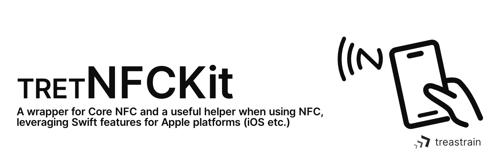

<picture>
  <source media="(prefers-color-scheme: dark)" srcset=".github/assets/tretnfckit-header_dark.png">
  <source media="(prefers-color-scheme: light)" srcset=".github/assets/tretnfckit-header_light.png">
  
</picture>

# TRETNFCKit
A wrapper for Core NFC and a useful helper when using NFC, leveraging Swift features for Apple platforms. \
(Renamed from `treastrain/TRETJapanNFCReader`)

[](https://github.com/treastrain/TRETJapanNFCReader/blob/master/LICENSE)
[](https://github.com/treastrain/TRETJapanNFCReader/stargazers) \

 \

[](https://github.com/apple/swift-package-manager) \
[](https://twitter.com/treastrain) \
[](https://github.com/treastrain/TRETJapanNFCReader/actions/workflows/swift.yml)
[](https://github.com/treastrain/TRETJapanNFCReader/actions/workflows/xcodebuild.yml)
[](https://github.com/treastrain/TRETJapanNFCReader/actions/workflows/xcodebuild_for_example_app.yml)

# Features
- ✅ (For beginners) A high-level wrapper for reader that can prevent forgetting to call necessary commands
  - `FeliCaTagReader`: FeliCa (NFC-F)
  - `ISO7816TagReader`: ISO 7816-compatible (NFC-A/B)
  - `ISO15693TagReader`: ISO 15693-compatible (NFC-V)
  - `MiFareTagReader`: MiFare (MIFARE Plus, UltraLight, DESFire) base on ISO 14443 (NFC-A)
  - `NFCReader`: (for use directly)
    - `NFCReader<NDEFMessage>`
    - `NFCReader<NDEFTag>`
    - `NFCReader<NativeTag>`
- ✅ (For experts) A low-level wrapper for reader session that includes a conversion to the `AsyncSequence` pattern from the delegation pattern originally provided by Core NFC
  - The asynchronous sequence is implemented in the following wrappers, which is very similar to [`CardSession.eventStream`](https://developer.apple.com/documentation/corenfc/cardsession/4318517-eventstream) (provided by Core NFC in iOS 17.4+, which allows communication with HCE-based NFC readers based on ISO 7816-4)
    - `AsyncNFCNDEFMessageReaderSession` (for [`NFCNDEFReaderSession`](https://developer.apple.com/documentation/corenfc/nfcndefreadersession) with [`NFCNDEFMessage`](https://developer.apple.com/documentation/corenfc/nfcndeftag)s)
    - `AsyncNFCNDEFTagReaderSession` (for [`NFCNDEFReaderSession`](https://developer.apple.com/documentation/corenfc/nfcndefreadersession) with [`NFCNDEFTag`](https://developer.apple.com/documentation/corenfc/nfcndefmessage)s)
    - `AsyncNFCTagReaderSession` (for [`NFCTagReaderSession`](https://developer.apple.com/documentation/corenfc/nfctagreadersession))
    - `AsyncNFCVASReaderSession` (for [`NFCVASReaderSession`](https://developer.apple.com/documentation/corenfc/nfcvasreadersession))
- ✅ Support SwiftUI

# Usage
## High-level wrappers
### Native Tags (FeliCa (NFC-F), ISO 7816-compatible (NFC-A/B), ISO 15693-compatible (NFC-V), MiFare (NFC-A))
#### FeliCa (NFC-F)
```swift
import TRETNFCKit_FeliCa

let reader = FeliCaTagReader()
try await reader.read(
    detectingAlertMessage: "Place the tag on a flat, non-metal surface and rest your iPhone on the tag.",
    didDetect: { reader, tags in
        let tag = tags.first!
        let feliCaTag = try await reader.connectAsFeliCaTag(to: tag)
        let (statusFlag1, statusFlag2, blockData) = try await feliCaTag.readWithoutEncryption(serviceCodeList: /* ... */, blockList: /* ... */)
        print(statusFlag1, statusFlag2, blockData)
        return .success(alertMessage: "Done!")
    }
}
```

##### for SwiftUI
```swift
import SwiftUI
import TRETNFCKit_FeliCa

Text("some view")
    .feliCaTagReader(
        isPresented: $isPresented,
        detectingAlertMessage: "Place the tag on a flat, non-metal surface and rest your iPhone on the tag.",
        didDetect: { reader, tags in
            let tag = tags.first!
            let feliCaTag = try await reader.connectAsFeliCaTag(to: tag)
            let (statusFlag1, statusFlag2, blockData) = try await feliCaTag.readWithoutEncryption(serviceCodeList: /* ... */, blockList: /* ... */)
            print(statusFlag1, statusFlag2, blockData)
            return .success(alertMessage: "Done!")
        }
    )
```

#### ISO 7816-compatible (NFC-A/B)
```swift
import TRETNFCKit_ISO7816

let reader = ISO7816TagReader()
try await reader.read(
    detectingAlertMessage: "Place the tag on a flat, non-metal surface and rest your iPhone on the tag.",
    didDetect: { reader, tags in
        let tag = tags.first!
        let iso7816Tag = try await reader.connectAsISO7816Tag(to: tag)
        print(iso7816Tag.identifier)
        // ...
        return .success(alertMessage: "Done!")
    }
}
```

##### for SwiftUI
```swift
import SwiftUI
import TRETNFCKit_ISO7816

Text("some view")
    .iso7816TagReader(
        isPresented: $isPresented,
        detectingAlertMessage: "Place the tag on a flat, non-metal surface and rest your iPhone on the tag.",
        didDetect: { reader, tags in
            let tag = tags.first!
            let iso7816Tag = try await reader.connectAsISO7816Tag(to: tag)
            print(iso7816Tag.identifier)
            // ...
            return .success(alertMessage: "Done!")
        }
    )
```

#### ISO 15693-compatible (NFC-V)
```swift
import TRETNFCKit_ISO15693

let reader = ISO15693TagReader()
try await reader.read(
    detectingAlertMessage: "Place the tag on a flat, non-metal surface and rest your iPhone on the tag.",
    didDetect: { reader, tags in
        let tag = tags.first!
        let iso15693Tag = try await reader.connectAsISO15693Tag(to: tag)
        print(iso15693Tag.identifier)
        // ...
        return .success(alertMessage: "Done!")
    }
}
```

##### for SwiftUI
```swift
import SwiftUI
import TRETNFCKit_ISO15693

Text("some view")
    .iso15693TagReader(
        isPresented: $isPresented,
        detectingAlertMessage: "Place the tag on a flat, non-metal surface and rest your iPhone on the tag.",
        didDetect: { reader, tags in
            let tag = tags.first!
            let iso15693Tag = try await reader.connectAsISO15693Tag(to: tag)
            print(iso15693Tag.identifier)
            // ...
            return .success(alertMessage: "Done!")
        }
    )
```

#### MiFare (MIFARE Plus, UltraLight, DESFire) base on ISO 14443 (NFC-A)
```swift
import TRETNFCKit_MiFare

let reader = MiFareTagReader()
try await reader.read(
    detectingAlertMessage: "Place the tag on a flat, non-metal surface and rest your iPhone on the tag.",
    didDetect: { reader, tags in
        let tag = tags.first!
        let miFareTag = try await reader.connectAsMiFareTag(to: tag)
        print(miFareTag.identifier)
        // ...
        return .success(alertMessage: "Done!")
    }
}
```

##### for SwiftUI
```swift
import SwiftUI
import TRETNFCKit_MiFare

Text("some view")
    .miFareTagReader(
        isPresented: $isPresented,
        detectingAlertMessage: "Place the tag on a flat, non-metal surface and rest your iPhone on the tag.",
        didDetect: { reader, tags in
            let tag = tags.first!
            let miFareTag = try await reader.connectAsMiFareTag(to: tag)
            print(miFareTag.identifier)
            // ...
            return .success(alertMessage: "Done!")
        }
    )
```

#### Use directly
```swift
import TRETNFCKit_NativeTag

let reader = NFCReader<NativeTag>()
try await reader.read(
    pollingOption: [.iso14443, .iso15693, .iso18092], // You can combine options to have the reader scan and detect different tag types at the same time.
    detectingAlertMessage: "Place the tag on a flat, non-metal surface and rest your iPhone on the tag.",
    didDetect: { reader, tags in
        let tag = tags.first!
        try await reader.connect(to: tag)
        switch tag {
        case .feliCa(let feliCaTag):
            await reader.set(alertMessage: "FeliCa\n\(feliCaTag.currentIDm as NSData)")
        case .iso7816(let iso7816Tag):
            await reader.set(alertMessage: "ISO14443-4 type A / B tag with ISO7816\n\(iso7816Tag.identifier as NSData)")
        case .iso15693(let iso15693Tag):
            await reader.set(alertMessage: "ISO 15693\n\(iso15693Tag.identifier as NSData)")
        case .miFare(let miFareTag):
            await reader.set(alertMessage: "MiFare technology tag (MIFARE Plus, UltraLight, DESFire) base on ISO14443\n\(miFareTag.identifier as NSData)")
        }
        return .success
    }
)
```

##### for SwiftUI
```swift
import SwiftUI
import TRETNFCKit_NativeTag

Text("some view")
    .nfcNativeTagReader(
        isPresented: $isPresented,
        pollingOption: [.iso14443, .iso15693, .iso18092], // You can combine options to have the reader scan and detect different tag types at the same time.
        detectingAlertMessage: "Place the tag on a flat, non-metal surface and rest your iPhone on the tag.",
        didDetect: { reader, tags in
            let tag = tags.first!
            try await reader.connect(to: tag)
            switch tag {
            case .feliCa(let feliCaTag):
                await reader.set(alertMessage: "FeliCa\n\(feliCaTag.currentIDm as NSData)")
            case .iso7816(let iso7816Tag):
                await reader.set(alertMessage: "ISO14443-4 type A / B tag with ISO7816\n\(iso7816Tag.identifier as NSData)")
            case .iso15693(let iso15693Tag):
                await reader.set(alertMessage: "ISO 15693\n\(iso15693Tag.identifier as NSData)")
            case .miFare(let miFareTag):
                await reader.set(alertMessage: "MiFare technology tag (MIFARE Plus, UltraLight, DESFire) base on ISO14443\n\(miFareTag.identifier as NSData)")
            }
            return .success
        }
    )
```

### NDEF Tags
```swift
import TRETNFCKit_NDEFTag

let reader = NFCReader<NDEFTag>()
try await reader.read(
    detectingAlertMessage: "Place the tag on a flat, non-metal surface and rest your iPhone on the tag.",
    didDetect: { reader, tags in
        let tag = tags.first!
        try await reader.connect(to: tag)
        let message = try await tag.readNDEF()
        print(message)
        return .success(alertMessage: "Done!")
    }
)
```

#### for SwiftUI
```swift
import SwiftUI
import TRETNFCKit_NDEFTag

Text("some view")
    .nfcNDEFTagReader(
        isPresented: $isPresented,
        detectingAlertMessage: "Place the tag on a flat, non-metal surface and rest your iPhone on the tag.",
        didDetectNDEFs: { reader, tags in
            let tag = tags.first!
            try await reader.connect(to: tag)
            let message = try await tag.readNDEF()
            print(message)
            return .success(alertMessage: "Done!")
        }
    )
```

### NDEF Messages
```swift
import TRETNFCKit_NDEFMessage

let reader = NFCReader<NDEFMessage>()
try await reader.read(
    invalidateAfterFirstRead: true,
    detectingAlertMessage: "Place the tag on a flat, non-metal surface and rest your iPhone on the tag.",
    didDetectNDEFs: { _, messages in
        print(messages)
        return .success(alertMessage: "Done!")
    }
)
```

#### for SwiftUI
```swift
import SwiftUI
import TRETNFCKit_NDEFMessage

Text("some view")
    .nfcNDEFMessageReader(
        isPresented: $isPresented,
        invalidateAfterFirstRead: true,
        detectingAlertMessage: "Place the tag on a flat, non-metal surface and rest your iPhone on the tag.",
        didDetectNDEFs: { _, messages in
            print(messages)
            return .success(alertMessage: "Done!")
        }
    )
```

## Low-level wrappers

### `AsyncNFCTagReaderSession` (for [`NFCTagReaderSession`](https://developer.apple.com/documentation/corenfc/nfctagreadersession))
```swift
import TRETNFCKit_Async

func asyncNFCTagReaderSessionSample() async {
    guard AsyncNFCTagReaderSession.readingAvailable else {
        return
    }
    
    let readerSession = AsyncNFCTagReaderSession(
        pollingOption: // ...
    )
    
    for await event in readerSession.eventStream {
        switch event {
        case .sessionIsReady:
            readerSession.alertMessage = "Place the tag on a flat, non-metal surface and rest your iPhone on the tag."
            readerSession.start()
        case .sessionStarted:
            // ..
        case .sessionBecomeActive:
            // ..
        case .sessionDetected(let tags):
            let tag = tags.first!
            do {
                try await readerSession.connect(to: tag)
                // ...
                readerSession.stop()
            } catch {
                readerSession.stop(errorMessage: error.localizedDescription)
            }
        case .sessionCreationFailed(let reason):
            // ..
        case .sessionInvalidated(let reason):
            // ..
        }
    }
}
```

#### with SwiftUI
See `Examples/TRETNFCKitExample/NFCNativeTagReaderExampleView.swift`.

### `AsyncNFCNDEFTagReaderSession` (for [`NFCNDEFReaderSession`](https://developer.apple.com/documentation/corenfc/nfcndefreadersession) with [`NFCNDEFTag`](https://developer.apple.com/documentation/corenfc/nfcndefmessage)s)
```swift
import TRETNFCKit_Async

func asyncNFCNDEFTagReaderSessionSample() async {
    guard AsyncNFCNDEFTagReaderSession.readingAvailable else {
        return
    }
    
    let readerSession = AsyncNFCNDEFTagReaderSession(
        invalidateAfterFirstRead: // ...
    )
    
    for await event in readerSession.eventStream {
        switch event {
        case .sessionIsReady:
            readerSession.alertMessage = "Place the tag on a flat, non-metal surface and rest your iPhone on the tag."
            readerSession.start()
        case .sessionStarted:
            // ...
        case .sessionBecomeActive:
            // ...
        case .sessionDetected(let tags):
            let tag = tags.first!
            do {
                try await readerSession.connect(to: tag)
                // ...
                readerSession.stop()
            } catch {
                readerSession.stop(errorMessage: error.localizedDescription)
            }
        case .sessionInvalidated(let reason):
            // ...
        }
    }
}
```

#### with SwiftUI
See `Examples/TRETNFCKitExample/NFCNDEFTagReaderExampleView.swift`.

### `AsyncNFCNDEFMessageReaderSession` (for [`NFCNDEFReaderSession`](https://developer.apple.com/documentation/corenfc/nfcndefreadersession) with [`NFCNDEFMessage`](https://developer.apple.com/documentation/corenfc/nfcndeftag)s)
```swift
import TRETNFCKit_Async

func asyncNFCNDEFMessageReaderSessionSample() async {
    guard AsyncNFCNDEFMessageReaderSession.readingAvailable else {
        return
    }
    
    let readerSession = AsyncNFCNDEFMessageReaderSession(
        invalidateAfterFirstRead: // ...
    )
    
    for await event in readerSession.eventStream {
        switch event {
        case .sessionIsReady:
            readerSession.alertMessage = "Place the tag on a flat, non-metal surface and rest your iPhone on the tag."
            readerSession.start()
        case .sessionStarted:
            // ...
        case .sessionBecomeActive:
            // ...
        case .sessionDetected(let messages):
            // ...
            readerSession.stop()
        case .sessionInvalidated(let reason):
            // ...
        }
    }
}
```

#### with SwiftUI
See `Examples/TRETNFCKitExample/NFCNDEFMessageReaderExampleView.swift`.

### `AsyncNFCVASReaderSession` (for [`NFCVASReaderSession`](https://developer.apple.com/documentation/corenfc/nfcvasreadersession))
```swift
import TRETNFCKit_Async

func asyncNFCVASReaderSessionSample() async {
    guard AsyncNFCVASReaderSession.readingAvailable else {
        return
    }
    
    let readerSession = AsyncNFCVASReaderSession(
        vasCommandConfigurations: // ...
    )
    
    for await event in readerSession.eventStream {
        switch event {
        case .sessionIsReady:
            readerSession.alertMessage = "Place the tag on a flat, non-metal surface and rest your iPhone on the tag."
            readerSession.start()
        case .sessionStarted:
            // ...
        case .sessionBecomeActive:
            // ...
        case .sessionReceived(let responses):
            // ...
            readerSession.stop()
        case .sessionInvalidated(let reason):
            // ...
        }
    }
}
```

# Availability
- iOS 13.0+
- iPadOS 13.0+
- macOS 10.15+
- Mac Catalyst 13.0+
- tvOS 13.0+
- watchOS 6.0+
- visionOS 1.0+
- Xcode 15.0+
  - Swift 5.9+

> [!NOTE]
> Features related to NFC tag reading are only available in iOS 13.0+.

# License
MIT License

# Notices
The names of e-money and the services are generally trademarks and registered trademarks of each company. This library is not officially provided by service providers and others.
